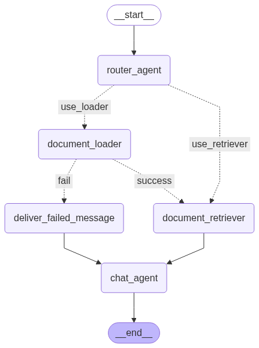
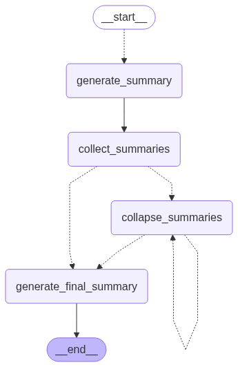

# IntelliTube
IntelliTube is an intelligent chat system that leverages Retrieval-Augmented Generation (RAG) to help users analyze and discuss content from YouTube videos, documents, and web pages. Built with LangGraph and LangChain, it provides a conversational interface for exploring multimedia content through natural language - made for students, researchers and educators.

## Features
 - **YouTube Videos**: Automatically extracts and processes video transcripts
 - **Web Pages**: Loads and analyzes website content
 - **Documents**: Supports PDF, TXT, and Python files
 - **Intelligent Routing**: Automatically determines content type and processing method
 - **Persistent Chat History**: Save and resume conversations across sessions

## Agents
IntelliTube is a multi-agent system. The full system is based on multiple agents, such as -
 - **Summarizer Agent**: Summarizes given document(s) using map-reduce summarization technique.
 - **Router Agent**: Detects URLs and Local document paths and routes the user query either to a document loader or directly to a retriever to retrieve documents from vector database.
 - **Chat Agent**: Processes the user query & retrieved documents and generates an answer to respond to the user query.

The workflow of IntelliTube AI looks something like this:

<p align="center"></p>


### [Summarizer Agent](agents/summrizer_agent.py)
Summarizer agent provides a qualityful summary of a given document. The graph of this agent looks something like below:

<p align="center"></p>

## Project Structure

```bash
intellitube
├── agents
│   ├── base_agent.py   # base agent class (all agents are built on top it)
│   ├── chat_agent      # work in progress
│   │   ├── agent.py
│   │   ├── __init__.py
│   │   ├── prompts.py
│   │   └── states.py
│   ├── __init__.py
│   ├── main_agent     # the agent responsible for all actions
│   │   ├── agent.py
│   │   ├── __init__.py
│   │   ├── prompts.py
│   │   └── states.py
│   └── summarizer_agent    # summarizes any text document
│       ├── agent.py
│       ├── __init__.py
│       ├── prompts.py
│       └── states.py
├── chatbot.py
├── data
│   ├── ...
├── images
│   ├── ...
├── __init__.py
├── llm.py  # llm initializer
├── README.md
├── requirements.txt
├── tests
│   ├── ...
├── tools
│   ├── document_loader_tools.py    # YouTube transcript/text document/webpage loader tools
│   └── __init__.py
├── ui.py   # the streamlit frontend UI
├── utils
│   ├── cacher.py   # caches webpages & yt-transcripts on local disk for faster loading
│   ├── chat_manager.py # saves chat history and metadata
│   ├── __init__.py
│   ├── mermaid2png.py
│   ├── path_manager.py
│   ├── video_transcript.py
│   └── youtube.py
└── vector_store.py # manages the qdrant vector database
```
